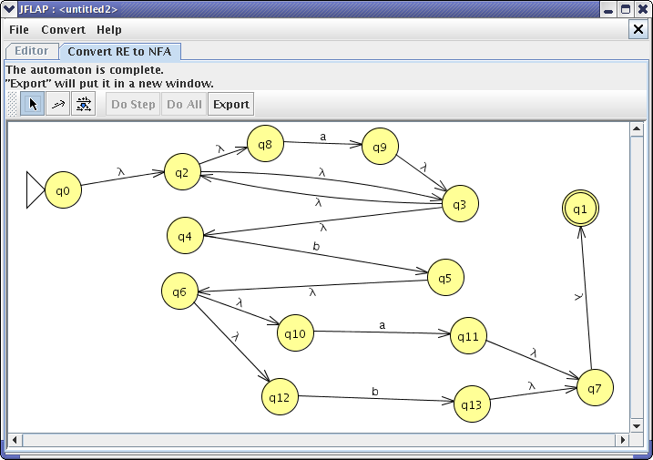

= GUI Editor and Visualizer for Finite Automata
:icons: image
:icontype: svg
:customcss: style.css
:revealjsdir: https://cdn.jsdelivr.net/npm/reveal.js@3.9.2
:revealjs_theme: white
:revealjs_hash: true
:revealjs_slideNumber: true
:title-slide-background-image: ./images/background-graph.svg
:title-slide-background-opacity: 0.5

== Members
* 1902089 Hardik Maheshwari
* 1902140 Aniruddh Rathi
* 1902147 Sradhanjan Saha
* 1902179 Mohit Varma

Group Number: 22 +
Guide: Prof. Sakshi Surve

== Abstract
[text-justify]
* The main aim of the project is to build an easy to use Graphical User Interface to edit and visualise Finite Automata.
* Users can use drag and drop features to generate automata diagrams without writing any markup.
* The diagrams can also be run to demonstrate the working of the automata.

== Problem Statement
[.text-justify]
To create a web based solution where a user can design a finite automata in a most easy and effective way and check his/her inputs using the inbuilt simulator.

== Literature Review
* FSM Simulator
* JFLAP

[.columns]
=== FSM Simulator
[.column]

.Limitations
[.column]
* FSM must be defined with markup
* Difficult to edit FSM

[.columns]
=== JFLAP
[.column]

[.column]
.Limitations
* Has to be run locally with Java
* Users cannot share designed automata easily

[transition=zoom]
== Example

=== Finite Automata

[mermaid.finite-automata, format=svg, background=0000000 /*, opts=inline*/]
----
stateDiagram-v2
	direction LR

	q0: #32;
	q1: 1
	q2: 2
	q3: 2

	[*] --> q0

	q0 --> q1 : 1
	q0 --> q2 : 2

	q1 --> q1 : 1
	q1 --> q3 : 2

	q2 --> q1 : 1
	q2 --> q2 : 2

	q3 --> q2 : 1, 2
----

=== Transition Table

[cols="4*^"]
|===
| State | `1`  | `2`  | Output

| `q0`  | `q1` | `q2` | -
| `q1`  | `q1` | `q3` | `1`
| `q2`  | `q1` | `q2` | `2`
| `q3`  | `q2` | `q2` | `2`
|===

== Technologies
* icon:html5[] HTML 5
* icon:css3[] CSS 3
* icon:javascript[] JavaScript
* icon:vue[] VueJS
* icon:typescript[] TypeScript

== References
. T. Singh, S. Afreen "Automata Simulator : A mobile app to teach theory of computation." sci-hub.se
. H. Dershem and R. McFall. "Finite State Machine Simulation in an Introductory Lab." academia.edu
. S. Rodger, J. Lim and S. Reading. "Increasing Interaction and Support in the Formal Languages and Automata Theory Course" academia.edu
. T. Finley and S. Reading. "Turning Automata Theory into a Hands-on Course" academia.edu
