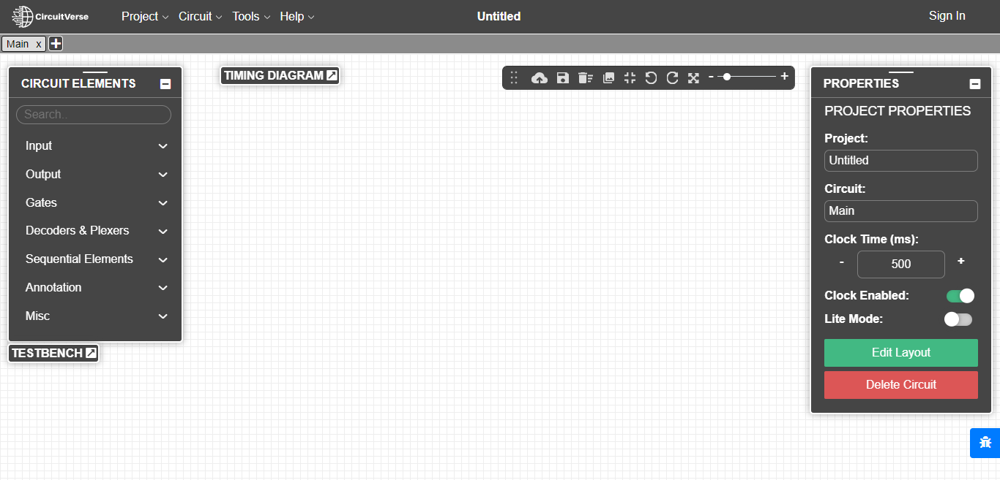
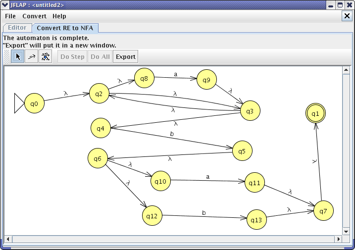
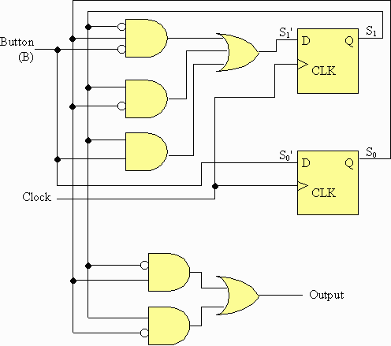

= Finite Automata to Digital Circuit Synthesizer
:icons: image
:icontype: svg
:customcss: style.css
:revealjsdir: https://cdn.jsdelivr.net/npm/reveal.js@3.9.2
:revealjs_theme: white
:revealjs_hash: true
:revealjs_slideNumber: true
:title-slide-background-image: ./images/background-circuit.svg
:title-slide-background-opacity: 0.4


== Members
* 1902085 Dheeraj Lalwani
* 1902086 Chirag Lulla
* 1902168 Kartik Soneji
* 1902184 Aayush Wadhwani

Group Number: 24 +
Guide: Prof. Sakshi Surve


== Introduction
[text-justify]
* Finite Automata are fundamental concepts in Automata Theory and Digital Logic Design.
* These FA can be converted into a circuit.
* Given an FA transition table as input, this project aims to generate the equivalent transition logic with primitive/basic gates/components.


== Literature Review
* CircuitVerse
* JFLAP

=== CircuitVerse


=== Limitations
* Does not support simulation of Automata
* Supports circuit simulation but not conversion from FA

=== JFLAP


=== Limitations
* Has to be run locally with Java
* Users cannot share designed automata easily


== Methodology

=== !
[text-justify%step]
* Determine what states / transitions are needed in order to solve the problem.
* Draw the state diagram, labelling the states and the edges.

=== Finite Automata

[mermaid.finite-automata, format=svg, background=0000000 /*, opts=inline*/]
----
stateDiagram-v2
	direction LR

	a: A. Bulb off
	b: B. Bulb on
	c: C. Bulb on
	d: D. Bulb off

	[*] --> a

	a --> a : 0
	a --> b : 1

	b --> c : 0
	b --> b : 1

	c --> c : 0
	c --> d : 1

	d --> a : 0
	d --> d : 1
----

=== !
[text-justify%step]
* Develop a mapping between state and representation in FFs.
* Write out the state transition table.

=== Transition Table

[cols="3*^"]
|===
| State | `button not pushed (0)` | `button pushed (1)`

| `A`  | `A`                      | `B`
| `B`  | `C`                      | `B`
| `C`  | `C`                      | `D`
| `D`  | `A`                      | `D`
|===

=== !
[text-justify%step]
* Based on the Activation table of the flip-flops used, construct the truth table from the transition table.
* Based on the truth table, construct the equation for each output variable.

=== Truth Table

[.condensed-table, cols="6*^.^"]
|===
2+| Present State
.2+| Button Input
2+| Next State
.2+| Output

| `b0` | `b1` | `b0` | `b1`

| 0 | 0 | 0 | 0 | 0 | 0
| 0 | 0 | 1 | 0 | 1 | 0
| 0 | 1 | 0 | 1 | 0 | 1
| 0 | 1 | 1 | 0 | 1 | 1
| 1 | 0 | 0 | 1 | 0 | 1
| 1 | 0 | 1 | 1 | 1 | 1
| 1 | 1 | 0 | 0 | 0 | 0
| 1 | 1 | 1 | 1 | 1 | 0
|===


=== !
[text-justify%step]
* Reduce the expressions using the suitable algorithm (K-Maps / Quine-McClusky algorithm)
* Convert the expressions to a circuit diagram using logic gates.

=== Circuit



== Application of our project
[.text-justify]
Finite Automata can be used to break down a circuit's function into a collection of states and rules which determine when the system moves from one state to another state.
The state diagram consists of nodes which represent the states and arrows (sometimes called edges) which give the possible transitions between states.


== Work done so far

=== !
1) Verification Of Finite Automata
```console
npx ts-node test.js
>> DFA error: state A defines more transition for input 1: B, A

>> DFA error: state B does not define a transition for input 1

>> null (No error in FA)
```

=== !
2) Generation of State Transition Table
[.stretch]
```console
npx ts-node test.js
>>	-------------------------------------
	|  State/Input  |    0    |    1    |
	-------------------------------------
	|      A/0      |    A    |    B    |
	-------------------------------------
	|      B/1      |    C    |    B    |
	-------------------------------------
	|      C/1      |    C    |    D    |
	-------------------------------------
	|      D/0      |    A    |    D    |
	-------------------------------------
```
=== !

3) Generation of Truth Table
[.stretch]
```console
npx ts-node test.js
>>	-------------------------------------------
	|b1      b0      i       b1      b0      O|
	-------------------------------------------
	|0       0       0       0       0       0|
	-------------------------------------------
	|0       0       1       0       1       0|
	-------------------------------------------
	|0       1       0       1       0       1|
	-------------------------------------------
	|0       1       1       0       1       1|
	-------------------------------------------
	|1       0       0       1       0       1|
	-------------------------------------------
	|1       0       1       1       1       1|
	-------------------------------------------
	|1       1       0       0       0       0|
	-------------------------------------------
	|1       1       1       1       1       0|
	-------------------------------------------
```
=== !
4) Generation of minterm expressions
```console
npx ts-node test.js
>>	b1 = b1'.b0.i' + b1.b0'.i' + b1.b0'.i + b1.b0.i
>>	b0 = b1'.b0'.i + b1'.b0.i + b1.b0'.i + b1.b0.i
>>	i = b1'.b0.i' + b1'.b0.i + b1.b0'.i' + b1.b0'.i
```

=== !
5) Reduction of minterm expressions using Quine-McCluskey reduction technique
```console
npx ts-node quineMcClusky.js
>>	b1 = b1'.b0.i' + b1.b0' + b1.i
>>	b0 = o
>>	i = b1'.b0 + b1.b0'
```

== Future Work
* [.done]#Determine what states / transitions are needed in order to solve the problem.#
* [.done]#Draw the state diagram, labelling the states and the edges.#
* Develop a mapping between state and representation in FFs.
* [.done]#Write out the state transition table.#

=== !

* [.done]#Based on the Activation table of the flip-flops used, construct the truth table from the transition table.#
* [.done]#Based on the truth table, construct the equation for each output variable.#
* [.done]#Reduce the expressions using the suitable algorithm (K-Maps / Quine-McClusky algorithm)#
* Convert the expressions to a circuit diagram using logic gates.


== Technologies
* icon:javascript[] JavaScript
* icon:typescript[] TypeScript


== References

. JFlap www.jflap.org
. CircuitVerse circuitverse.org
. link:papers_synthesizer/mccluskey1956.pdf[McCluskey(1956). Minimization of Boolean Functions. 1956]
. link:papers_synthesizer/kodwani2017.pdf[Kodwani, Rajurkar, Mundada(2017). Realization of Sequential Circuit using Finite state Machine]

[.stretch, background-video=images/ending.mp4, background-size=contain]
== !
